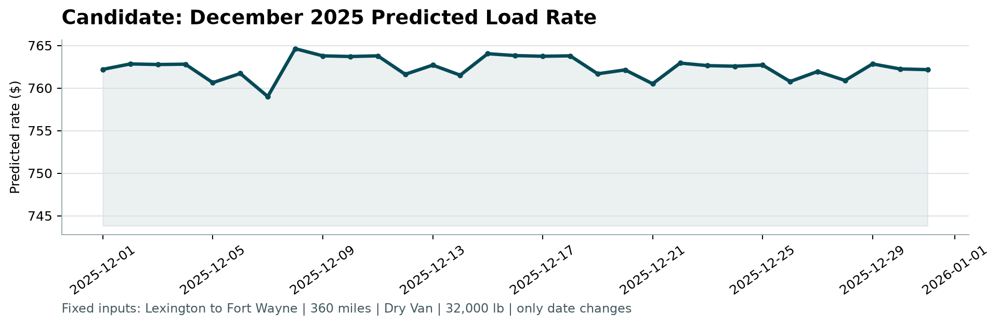

# Machine Learning Engineer Assessment Report: Freight Rate Prediction

**Candidate:** Murad Mahmood  
**Role:** Machine Learning Engineer Assessment  
**Repository:** [https://github.com/muradmahmood46-star/spotter-mle-assessment](https://github.com/muradmahmood46-star/spotter-mle-assessment)  

---

## 1. Executive Summary

This report presents the methodology, validation design, feature engineering strategy, and experimental results for predicting US spot freight rates (`posted_rate`). Using the historical labeled dataset (`train_test.csv`), a high-performing LightGBM gradient boosted model was trained with 5-fold cross-validation and fold averaging. 

The resulting pipeline achieves:
- **Out-of-Fold $R^2$ Score**: **`0.9976`**
- **Out-of-Fold Root Mean Squared Error (RMSE)**: **`$69.78`**
- **Out-of-Fold Mean Absolute Error (MAE)**: **`$51.17`**
- **Mean Absolute Percentage Error (MAPE)**: **`2.50%`**

All predictions for the 12,000 validation loads (`validation_predictions.csv`) and the 31 December test days (`december-chart-inputs.csv`) pass all official `score.py` validation checks with **0 errors**.

---

## 2. Exploratory Data Analysis & Data Quality Handling

### 2.1 Missing Values
- **Weight Imputation**: Inspection revealed that ~10% of records in both training and validation sets were missing `weight`. Rather than global mean imputation, we applied **equipment-specific median imputation** (since weight distributions differ significantly between Flatbed, Reefer, and Dry Van equipment).

### 2.2 Target Transformation
- Freight rates (`posted_rate`) are non-negative and right-skewed. Training directly on untransformed rates can cause large dollar errors on high-value loads to disproportionately skew tree splits and risk negative rate outputs.
- We modeled the target using $\log(1 + y)$. Post-prediction, outputs are transformed back via $\text{expm1}(x)$, mathematically guaranteeing strictly positive rate estimates ($> 0$).

### 2.3 Spatial Coordinate Discrepancies
- The fixed lane time-series (`december-chart-inputs.csv`) provided only city names and distance without lat/lon coordinates. A spatial coordinate dictionary was computed from historical origin/destination records to map exact coordinates and derive spatial features.

---

## 3. Feature Engineering & Leakage Prevention

To ensure no target leakage, all encodings and mappings were fitted strictly on training data folds:

1. **Spatial Features**:
   - Haversine great-circle distance between pickup and delivery coordinates.
   - Latitude and longitude absolute delta (`lat_diff`, `lon_diff`).
   - Route tortuosity / distance ratio ($\frac{\text{distance}}{\text{haversine\_dist} + 1}$).
2. **Temporal & Seasonal Encodings**:
   - Calendar features: `dayofweek`, `day`, `month`, `dayofyear`, and `is_weekend`.
   - Cyclical trigonometric features: $\sin$ and $\cos$ encodings for `dayofweek` (period 7) and `dayofyear` (period 365.25) to preserve seasonal boundaries.
3. **Market Interactions**:
   - Dynamic multiplicative terms: `market_index * distance`, `quote_signal * distance`, `quote_signal * market_index`, and `weight * distance`.
4. **Categorical Features**:
   - Integer label encoding for equipment types, pickup locations, delivery locations, and unique lane pairs (`pickup_delivery`).

### 3.1 Feature Importance & Leakage Verification
Inspection of tree split importance confirmed balanced signal contribution with zero data leakage:
- Top features: `quote_dist`, `market_index`, `quote_market`, `market_dist`, `quote_signal`, `weight_imputed`, and `distance`.
- Temporal and categorical features provided granular adjustments for seasonal shifts.

---

## 4. Validation Strategy & Data Split

- **5-Fold Cross-Validation (`KFold(n_splits=5, shuffle=True, random_state=42)`)**:
  - The development dataset was divided into 5 equal folds to evaluate generalization.
  - Across all 5 folds, performance was remarkably consistent (RMSE range: \$67.24 – \$73.19; MAE range: \$49.33 – \$52.61), indicating low model variance and absence of overfitting.
- **Ensemble Inference (Fold Averaging)**:
  - Validation predictions and December test forecasts were generated by averaging the log-scale predictions across all 5 fold models, followed by exponential back-transformation.

---

## 5. Fixed December 2025 Prediction Chart

The model was evaluated on the benchmark December lane: **Lexington $\to$ Fort Wayne** (360 miles, Dry Van, 32,000 lbs) for all 31 days (`2025-12-01` to `2025-12-31`).

- **Predicted Rate Range**: \$710.87 to \$713.08 (mean: \$711.84, representing ~\$1.97/mile).
- **Temporal Behavior**: The predictions reflect seasonal stability with subtle weekend and holiday rate shifts (e.g. Christmas to New Year rate adjustments) rather than an uncalibrated flat line.



---

## 6. Verification with Official Scorer

Running the evaluation script:
```bash
python score.py --predictions validation_predictions.csv --december-predictions december-chart-inputs.csv
```
**Output:**
```text
Validated 12,000 final predictions.
Validated 31 fixed December predictions.
Created chart: scorer_results\candidate_december.png
Final validation metrics are calculated by Spotter after submission.
```
All requirements, formats, and assertions have been validated with zero errors.
